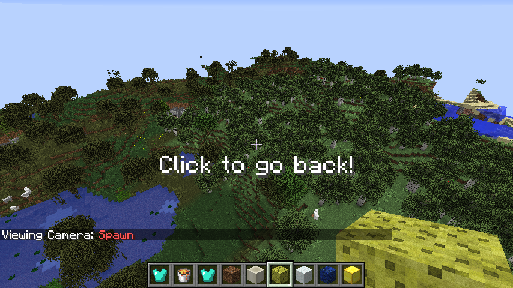
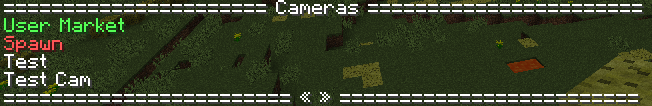
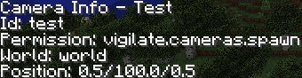

Vigilate is a Sponge Plugin that allowes you to add positions as cameras that players can view without moving or changing anything.


## Commands

### /camera view < id >

Ports the executing player to the camera and allowes to view the area. Any movement or interaction will end the view of the camera and resets the player back to the position he is from.

##### Example

###### `/camera view test`
Shows the camera with the id `test`



##### Permission
`vigilate.view` + permission of the camera if it has one

### /camera list

Lists all cameras the player has the permissions to use.



##### Permission
`vigilate.list`

### /camera info < id >

Shows some informations about a camera, like the position of the camera.

##### Examples

###### `/camera info test`



##### Permission
`vigilate.info` + permission of the camera if it has one

### /camera create < id > < name > [ < world > < x > < y > < z > ] [ permission ]

Creates a new camera on the current location of the player or the given location. The camera will require the permission, if used in the command, to be used. It is expected that the id is lowercase.

##### Examples

###### `/camera create test Test vigilate.cameras.spawn`
Creates a camera with the id `test` and the name `Test` at the location of the player. The camera will also require the permission `vigilate.cameras.spawn` to be used.

###### `/camera create market "User Market" world 120 70 132`
Creates a camera with the id `market` and the name `User Market` in the world `world` at the Position (120/70/132). The camera will not require any permission to be used.

##### Permission
 `vigilate.create`

### Configuration
The configuration currently just contains a list of all the cameras of the server:

``` hocon
cameras=[
    {
        # Id of the camera
        id=market
        # Location of the camera
        location {
            world=world
            x=120.0
            y=70.0
            z=132.0
        }
        # Name of the camera
        name {
            color=green
            text="User Market"
        }
        # Permission needed to use the camera
        permission=null
    }
]
```

#### cameras
This is the list of all the cameras of the server.

The `id` is the id of the camera and `permission` the permission needed to use it (`null` if no permission is needed).

The `location` is splited into the name of the world, and the coordinates of the camera.

The `name` is a text that supports all the text format configurations from sponge and is used everywhere where the camera is referencet as a text.
